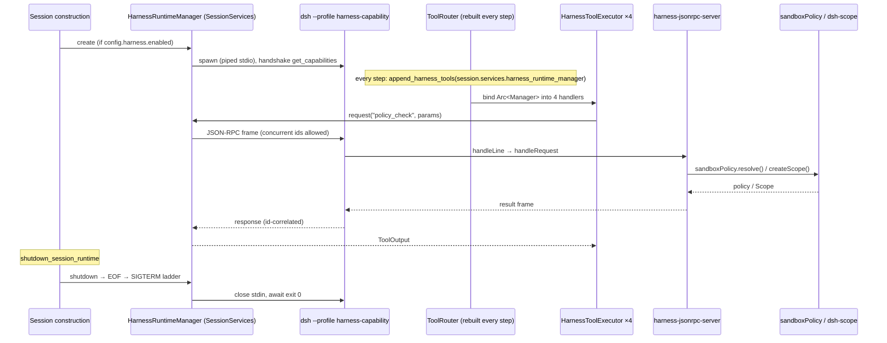

# SPEC — Codex consumes deepseek-harness as a Runtime Capability Provider

Status: draft r2 (source-calibrated; r2 resolves former B5/B6, adds B8, freezes the wire contract)
Date: 2026-09-29 (r2 same day — calibration pass, no scope expansion)
Repositories: `codex/` (Rust workspace, `codex-rs/`), `deepseek-harness/` (TypeScript pnpm monorepo)
Evidence index: `evidence-map.md` (Round 1 rows E-Cx/E-Dx; Round 2 calibration rows R1–R10)

Terminology: **SOURCE EVIDENCE** = read directly in source; **ARCHITECTURAL CONCLUSION** = inference with
reasoning attached; **BLOCKED** = source cannot prove, not filled by assumption.

---

## 1. Problem / Goal

Business problem: context assembly, scope isolation, and sandbox/policy decisions would otherwise be
re-implemented in every agent front-end. Policy answers diverge, audit evidence fragments. Making DSH
the single owner of runtime capabilities, with Codex as consumer, gives one place that answers "what
context applies, what scopes exist, is this action allowed".

Goal: Codex consumes DSH over `stdio + JSON-RPC` as a **Runtime Capability Provider**, PoC exactly four
operations:

```
get_context | get_capabilities | create_scope | policy_check
```

Non-goals: MCP, A2A, DSH driving Codex sessions, any code in this phase.

## 2. Business Architecture

Capability ownership (source-anchored):

| Capability | Business question | Owner today |
|---|---|---|
| `get_capabilities` | "What can this runtime do?" | none — static manifest, NEW payload |
| `get_context` | "What context applies?" | none — BLOCKED on semantics (B1) |
| `create_scope` | "Isolated registration/event domain" | `@deepseek-ai/dsh-scope` `createScope` (proven; per-scope behavior propagation BLOCKED, B8) |
| `policy_check` | "Is this filesystem action allowed?" | `SandboxPolicyService` policy source; evaluator NEW (B3) |

## 3. Technical Architecture

### 3.1 The central decoupling: Tool Registration ≠ Runtime Process Lifecycle (r2, P0-1)

**SOURCE EVIDENCE**

- `build_tool_router` is **per-step, stateless, and rebuilt every turn**: production call chain is
  `core/src/session/turn.rs:1774` `built_tools()` → `turn.rs:1843` `build_tool_router(...)`, reached
  from `capture_step_context_inner` (`core/src/session/mod.rs:3916`). The router is a throwaway
  `Arc<ToolRouter>`; it must never own a process.
- Long-lived resources live on **`SessionServices`** (`core/src/state/service.rs:48`):
  - `service.rs:50` `pub(crate) mcp_runtime: Arc<McpRuntime>` — doc: "The single owner of live MCP
    connections for this thread."
  - `service.rs:52` `mcp_handler_cache: McpHandlerCache`, `service.rs:53`
    `unified_exec_manager: UnifiedExecProcessManager`, `service.rs:101` `code_mode_service`.
- MCP process lifecycle is **per-Session (thread), not per-turn**:
  - created at Session construction: `core/src/session/session.rs:1572-1575` `Arc::new(McpRuntime::empty(..))`;
  - stdio processes spawned on publish: `core/src/session/mcp_runtime.rs:282` `publish_mcp_runtime` →
    `codex-mcp/src/rmcp_client.rs:1249` `new_stdio_client_with_protocol_mode`;
  - killed at session shutdown: `core/src/session/handlers.rs:287` `shutdown_session_runtime` →
    `handlers.rs:318` `sess.services.mcp_runtime.shutdown().await` →
    `codex-mcp/src/runtime.rs:780` `shutdown` → `rmcp-client/src/rmcp_client.rs:1059-1066`
    `shutdown` + `process.terminate()`. Same shutdown body also stops `code_mode_service`
    (`handlers.rs:311`) — an existing "host-owned long-lived child process" precedent.

**ARCHITECTURAL CONCLUSION (frozen for r2)**

```
Session (thread)                                     per-step ToolRouter
    ↓ SessionServices                                    ↓ rebuilt every step
HarnessRuntimeManager (NEW, field on SessionServices) ──► 4 × HarnessToolExecutor
    ↓                                                     │ (hold Arc<Manager>)
HarnessClient (spawn + JSON-RPC codec) ◄──────────────────┘ request()
    ↓
dsh --profile <harness-capability>  (child process)
```

- `HarnessRuntimeManager` is owned by `SessionServices`, created where `McpRuntime::empty` is created
  (`session.rs:1572-1575` region), destroyed in `shutdown_session_runtime` next to
  `mcp_runtime.shutdown()` (`handlers.rs:318`).
- `build_tool_router` only *references* the manager (same pattern as `spec_plan.rs:153` referencing
  `session.services.mcp_handler_cache`). The four handlers hold `Arc<HarnessRuntimeManager>`.
- DSH process lifetime = Session lifetime. Proven viable: this is exactly the McpRuntime /
  UnifiedExecProcessManager / CodeModeService lifecycle tier. Per-turn and per-tool lifetimes are
  explicitly rejected.

### 3.2 DSH plugin tree

Unchanged from r1: new Cordis plugin + profile bundle. See §6 and PLAN Phase 1 for the r2-frozen
dependency model (P0-3/P0-4).

## 4. Process Boundary

- 2 OS processes; Codex = parent, DSH = child via `dsh --profile <name>`; piped stdin/stdout only;
  stderr = diagnostics. (r1 evidence stands: `rmcp-client/src/local_stdio_transport.rs:37-49`;
  `packages/sdk/client/src/launch.ts:143`; `sdk/server/src/index.ts:3-4`.)
- Lifecycle (r2): spawn at Session start (when `harness.enabled`), tear down in
  `shutdown_session_runtime`. Shutdown semantics on the DSH side are implemented: sdk server answers
  `shutdown`, disposes root runtime, exits 0 (`sdk/server/src/index.ts:6-8`).

## 5. Protocol Boundary (r2: contract frozen)

**SOURCE EVIDENCE**

- Framing: newline-delimited JSON-RPC (`packages/sdk/protocol/src/transport.ts:1-5`); dialect
  compatibility proven both directions (r1: DSH `handleLine` :200-224 ignores `jsonrpc` key; codex
  `JSONRPCRequest` at `exec-server-protocol/src/rpc.rs:237` has no `deny_unknown_fields`).
- Request ids: DSH transport generates string ids `req_<uuid>` (`transport.ts:110`), accepts
  `string | number` inbound (`JsonRpcId`, `transport.ts:16`); codex `RequestId = String | Integer`
  (`rpc.rs:59-64`). Compatible.
- Concurrency: **proven** — `transport.ts:69` `private readonly pending = new Map<JsonRpcId,
  PendingRequest>()`; `request()` (:109-150) supports concurrent in-flight requests with per-id
  correlation and `AbortSignal` abandonment; `close()` rejects all pending (:82-84, `failPending`).
- Error shape (wire): `{jsonrpc:"2.0", id, error:{code, message}}` (`transport.ts:254-256`
  `writeError`); inbound error `data` is preserved when surfacing to callers
  (`JsonRpcResponseError`, `transport.ts:20-30`).
- Error codes emitted by the transport itself: `-32601` when no handler (:229-230), `-32603` when the
  handler throws (:235). Malformed JSON lines are **silently dropped** (:202-208) — no `-32700`
  response exists on this transport.

**ARCHITECTURAL CONCLUSION — frozen contract (r3: synced to as-implemented error surface)**

| Rule | Value | Status |
|---|---|---|
| Request id | codex→DSH: integer or `req_*` string; DSH→codex: `req_<uuid>` string | proven |
| Unknown method | `-32601` when no handler is registered; with a handler installed, unknown method throws → `-32603` + message `unknown DeepSeek Harness runtime capability method: <m>` | as-implemented (both transport paths verified in e2e) |
| Handler failure | `-32603` + failure message string | proven (transport) |
| Invalid params | `-32603` + semantic message `invalid params: <field/problem>` | **as-implemented** — typed `-32602` with `data` is NOT reachable: `transport.ts:245-253` hardcodes `-32603` for handler throws, `writeError` (:254-256) is private with no `data` param, and the handler signature `(method, params)` has no request-id channel. Fixing would require breaking the shared transport or duplicating it — out of PoC scope. The r2 `-32602`/`-32001` intent is preserved through structured messages |
| Scope not found | `-32603` + message `scope not found: <scopeId>` | **as-implemented** (same transport constraint) |
| Runtime unavailable (codex side: manager disabled/failed) | codex-side tool error (`RespondToModel("harness runtime unavailable: …")`), never on the wire | as-implemented |
| policy denied | **not an error** — normal result `{decision: "denied", reason}` | as-implemented, e2e verified |
| Malformed line | silently dropped by DSH; codex side must never rely on error feedback for framing bugs | proven |
| Concurrent in-flight | allowed; correlation by id both sides | proven (DSH `pending` map) / proven (codex e2e, 4-way concurrent) |

## 6. Runtime Capability Model (r2)

### 6.1 `get_capabilities` — introspection only

```
get_capabilities ≠ MCP tools/list ≠ dynamic tool registration
```

Codex registers the four tools **locally and fixed** in `append_harness_tools`; nothing on the wire
drives tool registration. `get_capabilities` returns a static manifest (runtime identity, profile,
the four operations with param/result schemas) for introspection/health. **NEW payload** (B2:
no registry exists in DSH source; `rg` zero hits, r1).

### 6.2 `get_context` — BLOCKED on semantics (B1, unchanged)

No DSH source defines external-consumer "context". PoC returns minimal NEW payload: runtime identity +
profile + sandbox mode + workspaceRoot + known scope ids.

### 6.3 `create_scope` — proven core, BLOCKED propagation (B8, new)

**SOURCE EVIDENCE**

- `packages/core/scope/src/index.ts:137` `createScope(ctx, key, options?)` returns
  `Scope { ctx, rawDispose, dispose }` (interface at `:110-118`); `dispose()` quiesces the backing
  fiber (`quiesceFiber`, `:122-126`).
- `ScopeKey = object` — opaque, identity-compared tag (`:11`); parent chain via
  `bindScopeParent`/`scopeParents` with cycle rejection (`:38-71`).
- Lifecycle owner: the backing fiber — `createScope` does `ctx.plugin(scope)` where `scope` is a
  no-op plugin (`:121-122`); disposal via `dispose()`/`rawDispose()`, and all registrations unload
  with the fiber (Cordis `Service` contract, `vendor/cordis/src/service.ts:52`).
- Scoped context = `fiber.ctx.extend({ [kScope]: key })` (`:143`); `Context.extend`
  (`vendor/cordis/src/context.ts:99-107`) creates a **prototype-chain child** — service lookups
  through it resolve to the **parent's registrations** (pass-through inheritance).
- Event routing: `scopeTarget` carrier admits listeners tagged with the key or any ancestor; events
  flow UP the chain, never down (`scope/index.ts:160-186`).
- Independent per-service resolution scopes exist only via `Context.isolate(name, label)`
  (`context.ts:121-125`); `reflect.provide` **throws** if the name is already provided in the same
  isolation scope (`vendor/cordis/src/reflect.ts:40-46`).

**Proven**: create / tag / parent-chain / dispose / pass-through service resolution through the scoped
context / event routing.

**BLOCKED (B8)**: "create_scope(scopeId) → 后续 policy_check(scopeId) 真正进入对应 Scope 并产生
scope-specific 行为" — no source mechanism makes `SandboxPolicyService` scope-aware (its resolution is
keyed on deployment defaults + per-session mode/cwd, `sandbox-policy/src/index.ts:105-126`), and a
scope created by `extend` cannot shadow an already-provided service without `isolate()` + new
registration, which is unproven territory for this service. A `Map<scopeId, ScopeKey>` alone does NOT
make scoped execution meaningful.

**PoC consequence (frozen)**: `policy_check` treats `scopeId` (optional) as an **existence check only**
(unknown id → error frame with message `scope not found: <scopeId>`); the policy answer is identical to
root resolution. Per-scope behavior differences are out of PoC scope and remain BLOCKED. Implemented
exactly this way (`harness-jsonrpc-server/src/server.ts:165-173`, e2e verified). Callers MUST omit the
`scopeId` key when it is absent — sending JSON `null` is rejected by the type check
(`typeof scopeId !== 'string'`); the codex handler omits the key (review finding F1, fixed).

### 6.4 `policy_check` — minimal filesystem semantics only

- Policy source (proven): `SandboxPolicyService.resolve(request)` (`sandbox-policy/src/index.ts:164`)
  returns the effective `SandboxExecutionPolicy`; modes `read-only | workspace-write |
  danger-full-access` (`packages/sandbox/sandbox/src/index.ts:30`); `workspaceRoot` absolute, falls
  back to `process.cwd()` (`sandbox-policy/src/index.ts:114-130`).
- Enforcement reality: OS-level (bwrap/seatbelt/landlock e2e suites under
  `packages/sandbox/sandbox-local/tests/`); there is **no queryable "check one path" function** —
  the PoC evaluator (operation × path × mode × workspaceRoot → allowed/denied/reason) is **NEW**
  (B3 stands).
- Explicitly out of PoC: network, process, approval, credential semantics.

## 7. Data Model (r2: frozen wire contract)

```
# get_capabilities          (NEW payload; introspection only — never drives registration)
→ {"id":1,"method":"get_capabilities","params":{}}
← {"jsonrpc":"2.0","id":1,"result":{"runtime":"deepseek-harness","profile":"harness-capability",
     "capabilities":[{"name":"get_context"},{"name":"get_capabilities"},
                     {"name":"create_scope"},{"name":"policy_check"}]}}

# get_context               (NEW payload)
→ {"id":2,"method":"get_context","params":{}}
← {"jsonrpc":"2.0","id":2,"result":{"runtime":"deepseek-harness","profile":"harness-capability",
     "sandbox":{"mode":"workspace-write","workspaceRoot":"/abs/path"},
     "scopes":["s1", ...]}}

# create_scope              (wraps proven dsh-scope createScope; disposal = runtime shutdown)
→ {"id":3,"method":"create_scope","params":{"key":"my-scope"}}
← {"jsonrpc":"2.0","id":3,"result":{"scopeId":"my-scope"}}
# error: duplicate scopeId → {"error":{"code":-32603,"message":"invalid params: scope key already exists: my-scope"}}

# policy_check              (evaluator NEW; policy source proven; scopeId = existence check ONLY)
→ {"id":4,"method":"policy_check",
   "params":{"operation":"write","path":"/workspace/a.txt","scopeId":"s1"}}
← {"jsonrpc":"2.0","id":4,"result":{"decision":"denied","reason":"mode is read-only"}}
← {"jsonrpc":"2.0","id":5,"result":{"decision":"allowed","reason":"path within workspaceRoot"}}

# errors (as-implemented): {"jsonrpc":"2.0","id":N,"error":{"code":-32603,"message":"<semantic message>"}}
#   all handler-side failures (unknown method / invalid params / scope not found / shutting down)
#   surface as -32603 with a structured semantic message — typed codes -32602/-32001 with
#   `data` are unreachable through the shared transport (see §5 table).
#   -32601 appears only when NO request handler is installed (transport-level).
#   runtime-unavailable exists only as a codex-side tool error, never on the wire.
#   policy denial is a RESULT, not an error.
```

## 8. Sequence Diagram (r2: session-owned runtime)



## 9. State Diagram (r2: tool lifetime ≠ runtime lifetime)

```mermaid
stateDiagram-v2
    [*] --> SessionCreated
    SessionCreated --> RuntimeStarting: config.harness.enabled
    SessionCreated --> ToolRequests: harness disabled (4 tools omitted; router proceeds)
    RuntimeStarting --> RuntimeReady: get_capabilities handshake OK
    RuntimeStarting --> RuntimeFailed: spawn failure / handshake timeout
    RuntimeReady --> ToolRequests: N × get_context / create_scope / policy_check
    ToolRequests --> RuntimeShuttingDown: session shutdown begins
    RuntimeShuttingDown --> RuntimeStopped: EOF → exit 0 (root fiber disposed)
    RuntimeShuttingDown --> RuntimeFailed: SIGKILL after grace
    RuntimeFailed --> RuntimeStopped
    RuntimeStopped --> [*]
```



Tool registration is per-step and stateless; the runtime is per-Session. Lifecycle facts, as
implemented:

- **Spawn failure / handshake timeout** (`RuntimeStarting → RuntimeFailed`): the manager degrades to
  `Disabled` (single `warn!`), so the four tools are never registered for that Session. This is a
  deliberate fail-quiet choice for the PoC — the Session continues without harness tools, and no
  per-call error can be surfaced because no tool exists to call.
- **Failure after a successful handshake** (`RuntimeShuttingDown → RuntimeFailed`, or a runtime that
  dies mid-session): tool calls fail with the codex-side "harness runtime unavailable" tool error;
  the Session is never torn down.

## 10. Codex ↔ DSH Interaction

r1 §10.2 (not MCP), §10.3 (not A2A), §10.4 (subagent-codex is the direction-reversed mirror and
existence proof) stand unchanged. r2 additions:

- **`get_capabilities` is runtime introspection only** — it never drives tool registration. The four
  tools are fixed in codex source (`append_harness_tools`); MCP's `tools/list`-driven surface
  (`McpHandlerCache::append_mcp_tools`, `mcp_tool_exposure.rs:38`) is deliberately not imitated.
- **`policy_check` is not a policy engine** — only the filesystem minimal model of §6.4; denial is a
  result, not an error; `scopeId` is an existence check (B8), omitted when absent (never `null`).
- **Config is not an arbitrary process launcher** — see §11 r2 rows: config carries only
  `enabled` + `profile` name; the argv shape is fixed at `<node> <dsh-entry> --profile <profile>` —
  no user-supplied argv, no arbitrary command. As implemented (r3, review F5), the node executable and
  the DSH entry path come from two implementation-layer env overrides
  (`CODEX_HARNESS_NODE`, `CODEX_HARNESS_DSH_BIN`; the latter is a PoC prerequisite, missing → spawn
  fails → tools degrade to absent). These are environment inputs, not config surface: they cannot
  change the argument structure.

## 11. Existing Source Evidence

r1 tables (SPEC §11 / evidence-map Round 1) stand. Round 2 additions (full rows in evidence-map):

| What | File | Symbol |
|---|---|---|
| per-step tool assembly | `core/src/session/turn.rs:1774,1843`; `core/src/session/mod.rs:3916` | `built_tools`, `build_tool_router` call |
| long-lived resource host | `core/src/state/service.rs:48-53,101` | `SessionServices` (mcp_runtime / mcp_handler_cache / unified_exec_manager / code_mode_service) |
| MCP runtime creation/kill | `core/src/session/session.rs:1572-1575`; `core/src/session/handlers.rs:287,311,318`; `codex-mcp/src/runtime.rs:780`; `rmcp-client/src/rmcp_client.rs:1059-1066` | `McpRuntime::empty`, `shutdown_session_runtime`, `shutdown`, `process.terminate()` |
| config nested section precedent | `config/src/config_toml.rs:165,289-293`; `core/src/config/mod.rs:609,729,872,1106` | `ConfigToml`, `mcp_servers`, `orchestrator_mcp_enabled`, `features: ManagedFeatures` |
| apps_enabled gating | `core/src/session/turn_context.rs:619` | `apps_enabled()` |
| feature flag machinery (rejected for this use) | `features/src/lib.rs:93,790,823,925,932` | `Feature`, `FeaturesToml`, `FeatureSpec`, `FEATURES` |
| cordis required vs optional dependency | `vendor/cordis/src/reflect.ts:10-17`; `vendor/cordis/src/registry.ts:71-86,296-301,330`; `packages/sdk/server/src/index.ts:22-24` | `ctx.get` (optional), `Inject.resolve` + `new Fiber(..., Inject.resolve(plugin.inject), ...)` (required), both patterns in one real file |
| scope full semantics | `packages/core/scope/src/index.ts:11,38-71,110-147,160-186`; `vendor/cordis/src/context.ts:99-107,121-125`; `vendor/cordis/src/reflect.ts:40-46` | `ScopeKey`, `bindScopeParent`, `Scope`, `createScope`, `scopeTarget`, `Context.extend`, `Context.isolate`, `provide` throws |
| transport concurrency + errors | `packages/sdk/protocol/src/transport.ts:69,82-84,109-150,202-208,229-235,254-256` | `pending` Map, `request(signal)`, `writeError`, `-32601/-32603` |
| profile mechanism | `packages/boot/app-boot/src/profile.ts:179-195`; `packages/bundle/sdk-app/package.json:31-35` + `cordis.patch.yml`; `packages/bundle/base/cordis.patch.yml:229-232` | `PROFILE_TEMPLATES`, `dsh.bundle.patch`, sandbox-policy row |
| stdout safety | `vendor/cordis/src/logger.ts:213-221`; `packages/bundle/sdk-app/cordis.patch.yml:1,24-25`; `packages/boot/cmdline/src/index.ts:108,217` | in-memory logger exporter, "Stdout belongs exclusively to JSON-RPC", help-only stdout writes |

## 12. BLOCKED / Unknown (r2 status)

| # | Item | Status r2 |
|---|---|---|
| B1 | `get_context` semantics | BLOCKED (unchanged) — PoC minimal NEW payload |
| B2 | unified capability registry | BLOCKED (unchanged) — static manifest |
| B3 | unified policy-check API | BLOCKED (unchanged) — evaluator NEW; inputs proven |
| B4 | `JsonRpcConnection` export vs local codec | OPEN design decision (unchanged, not on critical path) |
| B5 | codex config extension point | **RESOLVED r2** — `ConfigToml` nested section (§11) |
| B6 | profile stdout cleanliness | **RESOLVED r2** — structural proof (in-memory logger + audited writers) |
| B7 | app-server version drift | BLOCKED (unchanged, not on PoC path) |
| **B8** | **scope propagation into per-scope behavior** | **BLOCKED (new)** — creation/tag/dispose/pass-through proven; per-scope policy behavior unproven; PoC restricts `scopeId` to existence check |

## 13. PoC Scope (r2)

In scope: DSH plugin `harness-jsonrpc-server` (`inject = ['sandboxPolicy']`, required) + profile
`harness-capability` (base bundle + new `harness-app` bundle, dependency closure frozen in PLAN);
codex `harness-client` crate + `HarnessRuntimeManager` on `SessionServices` + four handlers +
`append_harness_tools` + `harness` config section. Tests per PLAN. Success: session-lifetime round
trip with concurrent tool calls; clean shutdown exit 0; policy denial as result.

Out of scope: per-scope behavior differences (B8), dispose_scope RPC, network/process/approval
policy, MCP/ACP compat, arbitrary argv launchers, non-PoC capabilities, direct main-branch work.

## 14. Implementation Status (closure, 2026-09-29)

Implementation complete on branches `feat/harness-capability-poc` (DSH) and
`feat/harness-capability-client` (codex); uncommitted, unmerged — awaiting human review.

Verified chain (all real commands, outputs in evidence-map Round 3):

- **Tests**: DSH vitest 25/25 after the gate round (harness-jsonrpc-server 20 + harness-app 2 +
  teardown/validation cases added for per-file coverage);
  codex `cargo test -p codex-harness-client` 4/4; `cargo test -p codex-core --lib harness` 11/11;
  `cargo test -p codex-core --lib tools::spec_plan` 58/58.
- **E2E (real process pair)**: `cargo test --test e2e_dsh -- --ignored` 2/2 — codex `HarnessClient`
  spawns real `dsh --profile harness-capability`, handshake + all four operations + 4-way concurrent
  + unknown-method error frame + clean shutdown (1.09s). DSH-side probe: all four methods answered
  per §7, policy denial as result, stdin EOF → exit 0, stdout protocol-frames-only.
- **LLM-in-the-loop E2E (r4: RUN, verified — two providers)**: a real model drives the agent loop and
  calls harness tools. Both runs use the same codex binary, the same `dsh --profile
  harness-capability` runtime, and the same temp `CODEX_HOME` shape (config `[harness] enabled=true`).

  *Run A — local model, no API key* (`gpt-oss:20b` via ollama, provider `http://localhost:11434/v1`):
  prompt asks for `harness.policy_check(operation="write", path="/tmp/outside.txt")`; 31s, exit 0.
  1. codex debug log `codex_core::stream_events_utils: ToolCall: harness.policy_check`;
  2. `codex_core::tools::parallel: tool call completed … tool_name=harness.policy_check
     tool_source="direct" handler_duration_ms=72`;
  3. the session rollout contains the runtime's own result text `path outside workspaceRoot`;
  4. final model answer `denied`, matching `SandboxPolicyService` mode `workspace-write`.

  *Run B — production provider GLM* (`model_provider="ZAI"`, `model="glm-5.3"`, reasoning effort
  `max`, `base_url=https://open.bigmodel.cn/api/v1`, `wire_api=responses`; 12s and 20s, both exit 0):
  1. single-tool prompt → `ToolCall: harness.policy_check` in the log, final answer `denied`;
  2. two-step prompt (`create_scope(key="glm-scope")` then `policy_check(operation="read",
     path="/tmp/anything.txt", scopeId="glm-scope")`) → both tool calls completed with
     `tool_source="direct"` (handler 3ms / 5ms), and the model replied
     `glm-scope` / `allowed` / `read permitted under mode workspace-write` — the reason string is the
     runtime's own text, so the scope-id path (F1) and cross-call scope state are model-verified.

  This exercises the chain the process-pair test bypasses: model → ToolRouter → `ToolExecutor` →
  `HarnessRuntimeManager` → `HarnessClient` → real DSH process → capability service → back to model.
  (Earlier revisions recorded this as NOT RUN; superseded by runs A and B.)
- **Pre-push gate evidence (r4)**: `cargo fmt --all -- --check` exit 0; `cargo clippy
  -p codex-harness-client -p codex-core --all-targets` exit 0 with zero errors; DSH per-file coverage
  (100% thresholds) clean for all three new source files. DSH-side pre-push `pnpm run typecheck` is
  BLOCKED by two pre-existing TS2769 errors in `packages/client/ui-primitives/src/markdown/parse.ts`
  (untouched by this branch) — an environment/baseline issue, not caused by this work.
- **Commits (both branches, unpushed)**: DSH `82e5e0f6db` + `fe3e4dbaa1`;
  codex `720186f121` + `99694b89a3`.
- **Known deviation**: typed error codes `-32602`/`-32001` unreachable through the shared transport;
  implemented as `-32603` + structured semantic message (§5). Documented, accepted; do not modify the
  transport to chase the r2 contract.

Environment issues (EXISTING BASELINE / ENVIRONMENT — reproduced on pristine tracked baseline, not
caused by this work; do not fix here):

1. Building `lib/` in the DSH working copy triggers a vite module-singleton duplication
   (`FiberState` undefined) that breaks existing suites (e.g. `packages/sdk/server/tests/
   plugin-apply.spec.ts`) — reproduced with all PoC changes stashed. Clean-state vitest is green.
2. Three typert startup warnings (`typert-registry` import failure cascade) appear identically on
   the shipped `sdk` profile.

Follow-ups (recorded, not done): regenerate `codex-rs/core/config.schema.json`; add BUILD.bazel
target for `codex-harness-client`; wire an API-key environment for the LLM-in-the-loop E2E.

### 14.1 Independent review round (2026-09-29, second pass)

An independent reviewer audited both branch diffs against this SPEC/PLAN. Two implementation defects
were found and fixed; docs were re-synced. Findings and resolutions (full trail in evidence-map
Round 4):

| # | Severity | Finding | Resolution |
|---|---|---|---|
| F1 | Blocker | codex handler always serialized `"scopeId": null`; the runtime rejects a non-string `scopeId`, so every scope-less `policy_check` failed end-to-end (`handlers/harness.rs` build_params; the unit test had codified the bug) | fixed: the key is omitted when absent; unit test now asserts absence; e2e already proves the runtime accepts params without the key |
| F2 | Major | `HarnessClient::shutdown` aborted the reader task before failing in-flight requests, so `rx.await` hung until client drop; PLAN 2.5's fail-pending requirement was unimplemented | fixed: shutdown drains and fails all pending requests with `Unavailable` before aborting tasks; new deterministic regression test (`/bin/cat` as a never-answering-but-EOF-respecting fixture) asserts no hang and fast post-shutdown failure |
| F3 | Minor | `request()` leaked a pending-map entry when the writer channel had closed | fixed: entry removed on send failure |
| F4 | Nit | zero-arg tools failed on an empty argument string | fixed: empty/whitespace arguments normalize to `{}` (mirrors `handlers/mcp.rs` hook-input precedent) |
| F5–F9 | Minor/Nit | doc-vs-code wording: env-provided DSH entry (not "code-fixed"), `inject` list, scope map shape, spawn-failure degradation semantics, citation lines | docs synced (this revision) |

Post-fix verification: `cargo test -p codex-harness-client` 4/4 (was 3/4 with the racy test);
`--lib harness` 11/11; e2e unchanged; DSH code untouched by the fixes.
